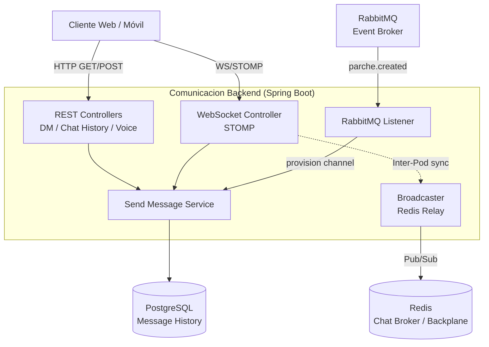
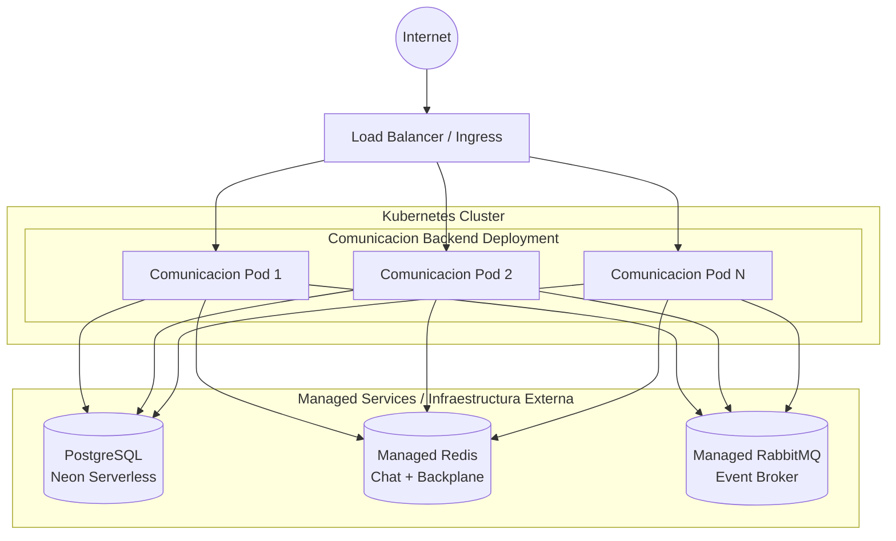

# Comunicacion Backend Microservice

Este microservicio es responsable de gestionar la comunicación en tiempo real entre usuarios de la plataforma U-Link. Maneja mensajes directos (DM), canales de chat dentro de los parches (grupos), historial de conversaciones, y sesiones de voz (señalización WebRTC). Forma parte del ecosistema **PATRICIA** y habilita la interacción social instantánea entre miembros.

## ¿Qué hace el microservicio?

1. **Mensajería en Tiempo Real:** Utiliza WebSockets (STOMP) para entregar mensajes instantáneos tanto en conversaciones directas (DM) como en canales de grupo asociados a parches.
2. **Sincronización Multi-nodo (Backplane):** Implementa un patrón de *Backplane* usando Redis Pub/Sub para sincronizar mensajes entre múltiples instancias del servicio. Si dos usuarios están conectados a distintos pods pero en el mismo canal, Redis enruta los eventos correctamente.
3. **Persistencia de Historial:** Almacena todo el historial de mensajes en PostgreSQL para que los usuarios puedan cargar conversaciones anteriores y navegar el historial.
4. **Sesiones de Voz (WebRTC Signaling):** Proporciona endpoints de señalización para establecer y gestionar llamadas de voz punto a punto entre usuarios, facilitando el intercambio de ofertas/respuestas ICE.
5. **Integración Orientada a Eventos:** Escucha eventos de dominio a través de RabbitMQ (AMQP), como la creación de un parche para automatizar la creación de canales de chat asociados.

---

## Parámetros de Calidad y Principios de Diseño

* **Arquitectura Hexagonal (Puertos y Adaptadores):** El dominio está desacoplado de la infraestructura mediante puertos (interfaces) y adaptadores (implementaciones concretas), facilitando el testing y la sustitución de componentes.
* **Principios SOLID:**
  * *Single Responsibility Principle (SRP):* Separación clara entre controladores REST (`DmController`, `ChatHistoryController`), WebSockets (`ComunicacionStompController`), lógica de negocio (`SendMessageService`), sesiones de voz (`VoiceSessionController`) y broadcasting (`ComunicacionBroadcaster`).
  * *Dependency Inversion Principle (DIP):* Uso de inyección de dependencias a través de constructores inyectados.
* **Alta Disponibilidad y Escalabilidad Horizontal:** Estado efímero delegado a Redis, persistencia en PostgreSQL, diseñado para escalar horizontalmente.
* **Tolerancia a Fallos:** *Health Probes* (liveness, readiness) a través de Spring Boot Actuator.
* **Testing y Code Coverage:** *Coverage Gate* con JaCoCo (mínimo 80% en líneas).

---

## Diagrama de Arquitectura



---

## Diagrama de Despliegue



## Tecnologías Principales

* Java 21
* Spring Boot 4.0.3
* Spring Web, Spring WebSockets
* Spring Security (JWT)
* Spring Data JPA (PostgreSQL)
* Spring Data Redis (Backplane + Chat Broker)
* Spring AMQP (RabbitMQ)
* Flyway (Migrations)
* JJWT 0.12.6
* Springdoc OpenAPI 2.8.5
* JSpecify 1.0.0
* Spring Boot Actuator
* JaCoCo (Coverage)

## API Documentation

The service exposes a RESTful API documented via OpenAPI. Once the application is running, you can explore the API using the Swagger UI available at:
```
http://<HOST>:<PORT>/swagger-ui.html
```
The OpenAPI specification is generated automatically by Springdoc and can be accessed at `/v3/api-docs`.

## Running Locally

### Prerequisites
- Java 21 (or newer)
- Maven 3.9+
- Docker (optional, for containerized execution)
- Access to a PostgreSQL instance (local or remote)
- Access to a Redis instance (local or remote)
- Access to a RabbitMQ broker (local or remote)

### Steps
1. Clone the repository and navigate to the project root.
2. Set the required environment variables (see *Configuration* section below).
3. Build the project:
   ```
   ./mvnw clean package
   ```
4. Run the application:
   ```
   java -jar target/comunicacion-0.0.1-SNAPSHOT.jar
   ```
   The service will start on port **8084** by default.

## Docker Deployment

A Dockerfile is provided for containerizing the microservice. Build and run the image with:
```bash
docker build -t comunicacion-backend:latest .

docker run -d \
  -p 8084:8084 \
  -e "SPRING_PROFILES_ACTIVE=prod" \
  -e "SPRING_DATASOURCE_URL=jdbc:postgresql://postgres:5432/comunicacion" \
  -e "SPRING_REDIS_HOST=redis" \
  -e "SPRING_RABBITMQ_HOST=rabbitmq" \
  -e "JWT_SECRET=your-secret-key" \
  comunicacion-backend:latest
```

A `docker-compose.yml` is also provided for local development with PostgreSQL, Redis, and RabbitMQ:
```bash
docker-compose up -d
```

## Configuration

The service requires the following environment variables:

| Variable | Description | Required |
|----------|-------------|----------|
| `JWT_SECRET` | Secret key for JWT validation (shared with Auth service) | Yes |
| `SPRING_DATASOURCE_URL` | PostgreSQL JDBC URL | Yes |
| `SPRING_DATASOURCE_USERNAME` | PostgreSQL username | Yes |
| `SPRING_DATASOURCE_PASSWORD` | PostgreSQL password | Yes |
| `SPRING_REDIS_HOST` | Redis host for chat broker and backplane | Yes |
| `SPRING_RABBITMQ_HOST` | RabbitMQ host for domain events | Yes |
| `SPRING_RABBITMQ_USERNAME` | RabbitMQ username | Yes |
| `SPRING_RABBITMQ_PASSWORD` | RabbitMQ password | Yes |
| `BACKPLANE_ENABLED` | Enable Redis backplane for multi-pod sync | No (default: false) |
| `PARCHES_CORE_URL` | URL of the Parches service for inter-service calls | Yes |

## Testing

Unit and integration tests are located under `src/test/java`. Run the full test suite with:
```bash
./mvnw verify
```
Coverage is enforced by JaCoCo with a minimum of **80%** line coverage.

## Contributing

Contributions are welcome! Please follow these steps:
1. Fork the repository.
2. Create a feature branch (`git checkout -b feature/awesome-feature`).
3. Implement your changes, ensuring existing tests pass and adding new tests if needed.
4. Submit a Pull Request with a clear description of the changes.

All contributions must adhere to the project's coding standards and pass the CI pipeline.

## License

This project is licensed under the **Apache License 2.0**. See the `LICENSE` file for details.
